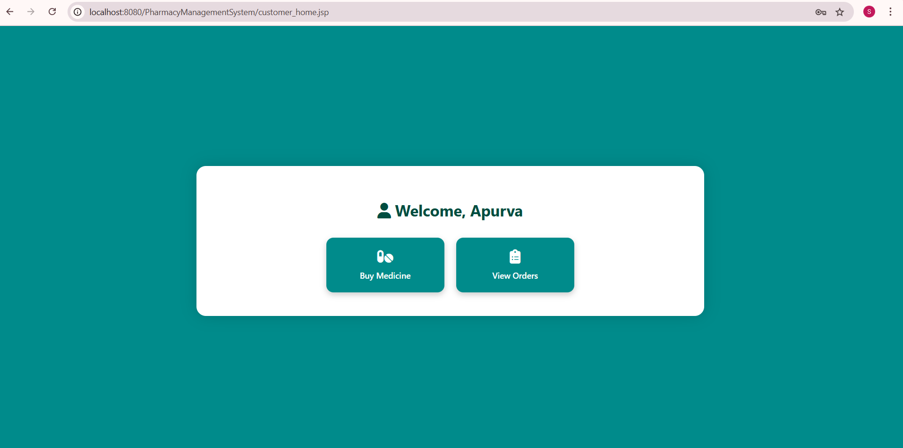
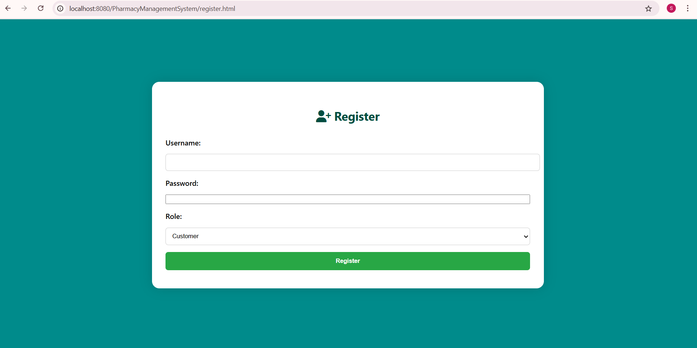
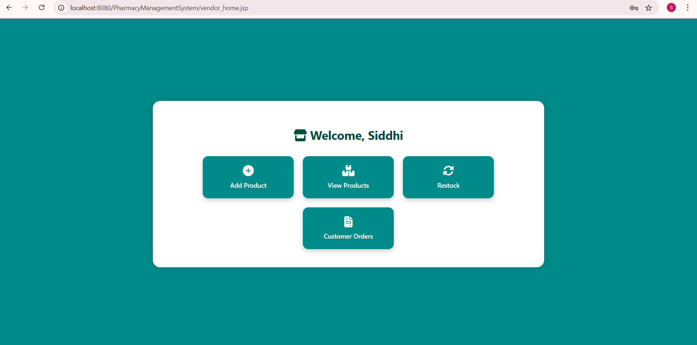

# 💊 Pharmacy Management System

A complete web-based **Pharmacy Management System** built using **Java Servlets**, **JSP**, and **MySQL**.  
This system allows vendors to manage medicines and customers to browse, purchase, and view orders.

---

## 🚀 Features

- 🔐 Vendor and Customer login/registration
- 💊 Add, edit, delete medicines (Vendor)
- 🛒 Purchase medicine (Customer)
- 📦 View order history and inventory
- 🗂️ Role-based access (Customer/Vendor)
- 🖥️ JSP-based dynamic UI with HTML/CSS/JavaScript

---

## 🛠️ Tech Stack

| Layer      | Technology                |
|------------|---------------------------|
| Backend    | Java, Servlet API         |
| Frontend   | HTML, CSS, JS, JSP        |
| Database   | MySQL (`pharmacy_db`)     |
| Architecture | MVC + DAO Pattern        |
| Tools      | Apache Tomcat, MySQL Workbench |

## 📸 Screenshots

### 🏠 Customer Home Page

### 📝 Register Page

### 🧑‍💼 Vendor Home Page

